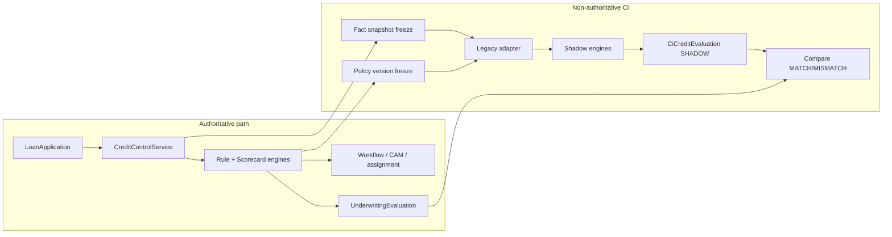
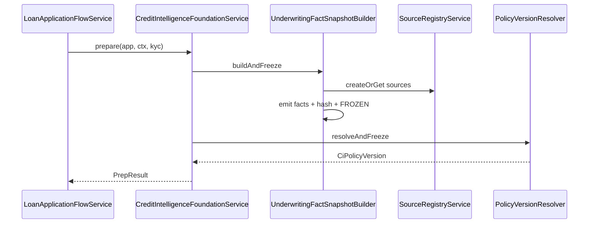

# 01 — Foundation Phase F Architecture

Phase F adds a non-authoritative Credit Intelligence foundation beside existing underwriting.

## Goals

- Capture immutable underwriting fact snapshots
- Freeze policy versions used by production engines
- Run shadow evaluation without changing authoritative outcomes
- Compare production vs shadow for parity monitoring

## Integration point

`LoanApplicationFlowService.underwriteApplication`:

1. Resolve `EffectiveUnderwritingContext` (unchanged)
2. Pass gates (KYC / GST / bureau)
3. Status → `UNDERWRITING`
4. **CI prepare** (flagged): snapshot + policy freeze
5. Production rule/scorecard/legacy evaluation (unchanged)
6. Record `UnderwritingEvaluation`
7. **CI afterProduction**: optional shadow (flagged)
8. Assignment / CAM / workflow continue as today

## Feature flags

```yaml
credit-intelligence:
  foundation.enabled: false
  shadow-evaluation.enabled: false
  shadow-evaluation.tenant-ids: []
  shadow-evaluation.product-codes: []
  shadow-evaluation.async: false
  source-registry.enabled: false
  internal-token: ""
```

When foundation is off, prepare returns empty and production is untouched.

## Coexistence



## Snapshot creation



## Tables (Flyway V86/V87)

| Table | Role |
|-------|------|
| `ci_source_record` / `ci_source_artifact` | Provenance references |
| `ci_fact_definition` | Seeded canonical paths |
| `ci_fact_snapshot` / `ci_underwriting_fact` | Immutable snapshots |
| `ci_policy_package` / `ci_policy_version` | Frozen policy |
| `ci_credit_evaluation` / `ci_evaluation_stage` / `ci_standard_rule_result` | Shadow + production reference |

## Immutability

- Service: `addFact` rejects `FROZEN` / `INVALID`
- Status transition BUILDING → FROZEN after hash
- Published policy versions are reused by content hash; edits create a new version

## Security

Internal APIs under `/api/v1/internal/credit-intelligence` require `X-Internal-Token` when `credit-intelligence.internal-token` is non-blank. Blank token allows local access with a warn log. Optional `X-Tenant-Id` enforces tenant match.

## Rollback

Set `foundation.enabled` and `shadow-evaluation.enabled` to `false`. No production decision path depends on CI tables.
