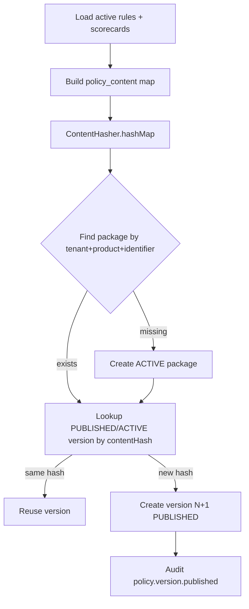

# 03 — Policy Versioning (Phase F)

## Identifier

- Package policy identifier: `UNDERWRITE_LEGACY_V1`
- Orchestration: `LEGACY_UNDERWRITE_APPLICATION_V1`
- Merge precedence: `HARD_RULE > SCORECARD > RULES > LEGACY`

## Freeze content

```json
{
  "orchestrationVersion": "LEGACY_UNDERWRITE_APPLICATION_V1",
  "mergePrecedence": "HARD_RULE > SCORECARD > RULES > LEGACY",
  "productCode": "...",
  "borrowerType": "...",
  "ruleSets": [ { "rulesJson": ..., "filters": ... } ],
  "scorecards": [ { "scorecardJson": ..., "thresholdsJson": ..., "hardRulesJson": ... } ]
}
```

Loaded from active `UnderwritingRuleSet` and `UnderwritingScorecard` rows matching borrower type + loan product (priority desc).

## Publishing flow



## Immutability

Published/active versions are never edited in place. Material policy change → new version with new content hash.

## Linkage

Shadow `CiCreditEvaluation.policyVersionId` points at the frozen version used for that run.
