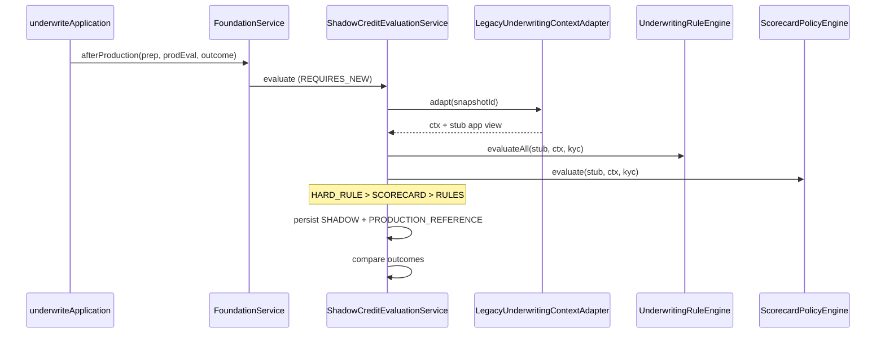

# 04 — Shadow Evaluation Operations

## Execution sequence

## Constraints

- No `LoanApplication` repository save
- No workflow / assignment / CAM / sanction / notifications / AI
- Stub app built from snapshot `applicationView` only
- Failures caught → evaluation `FAILED`, audit `underwriting.shadow.failed`, **no throw** to production

## Comparison

| Production | Shadow overallOutcome | comparisonStatus |
|------------|----------------------|------------------|
| APPROVED | APPROVED | MATCH |
| REJECT / REJECTED | REJECTED | MATCH if both reject |
| Different after normalize | — | MISMATCH |

`overallOutcome` keeps credit decision strings (`APPROVED` / `REJECTED` / `MANUAL_REVIEW`) for clarity. Per-rule `StandardRuleResult.outcome` maps to PASS / FAIL / REFER.

## Async

`shadow-evaluation.async=true` submits to `creditIntelligenceShadowExecutor` (bounded pool of 2). Default `false` for deterministic tests.

## Audit events

- `underwriting.shadow.started`
- `underwriting.shadow.completed`
- `underwriting.shadow.failed`
- `underwriting.shadow.mismatch`

Bodies contain IDs only (no PII / provider payloads).

## Replay

`POST /api/v1/internal/credit-intelligence/replay` with `{snapshotId, policyVersionId}` runs non-authoritative shadow again.
