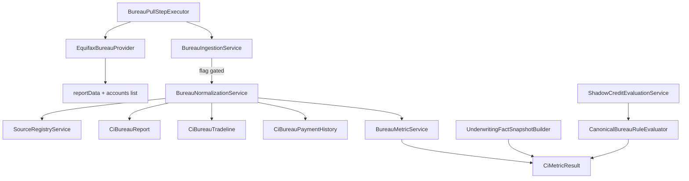

# 06 — Bureau Canonicalization (Phase C1)

## Purpose

Introduce provider-neutral bureau report / tradeline persistence and deterministic metrics **behind feature flags**, without changing production underwriting decisions.

## Investigation findings (verified before implementation)

| Finding | Implication |
|---------|-------------|
| Only Equifax retail is wired (`EquifaxBureauProvider`) | Subject type COMMERCIAL is modeled; adapter remains consumer Equifax |
| Equifax previously aggregated `//sch:Account` only | No tradeline persistence until C1 |
| `LIVE_UNSECURED_LOAN_COUNT` gap default `2` in `CreditControlService` | Production still uses legacy gap; canonical path must emit `DATA_INSUFFICIENT` when tradelines missing — never invent counts |
| Simulated Equifax fallback has aggregates only | Sets `tradelineExtractionStatus=MISSING` — no invented accounts |
| Sample fixture `simulated/sample-bureau-report.html` is Equifax SOAP XML | Uses `History48Months/Month` (not coded PaymentHistory string) |

## Architecture



## Packages

`com.los.core.creditintelligence.bureau`

- `domain` — enums + JPA entities (V88 tables)
- `repository` — Spring Data repos
- `provider` — `EquifaxBureauAccountExtractor` (EQUIFAX_PARSER_V2)
- `service` — taxonomy, live classifier, normalize, metrics, ingestion, HARD_LIVE_UNSECURED evaluator
- `api` — `BureauCanonicalAdminController`

## Feature flags

```yaml
credit-intelligence:
  canonicalization:
    bureau:
      enabled: false
      tenant-ids: []
      product-codes: []
      use-for-shadow-rules: false
      persist-tradelines: true
      freshness-days: 365
      live-unsecured-threshold: 6
```

When `enabled=false`, bureau pull behaviour is unchanged aside from richer `reportData` fields from Equifax (accounts list when XML parse succeeds). Ingestion is skipped.

## Safety constraints

- Production `CreditControlService` gap defaults unchanged
- Authoritative underwrite decision unchanged
- No raw bureau XML in fact/metric tables or ordinary logs
- Account numbers stored as SHA-256 hash + last4 only
- Canonicalization failures never fail the bureau pull

## Hook point

After successful `KycStepResult` save in `BureauPullStepExecutor`:

```java
bureauIngestionService.ingestFromPull(app, reportData, transactionId, stepResult.getId());
```

## Related docs

- [07_bureau_taxonomy_and_metrics.md](07_bureau_taxonomy_and_metrics.md)
- [08_bureau_shadow_comparison.md](08_bureau_shadow_comparison.md)
- [09_phase_c1_validation_report.md](09_phase_c1_validation_report.md)
