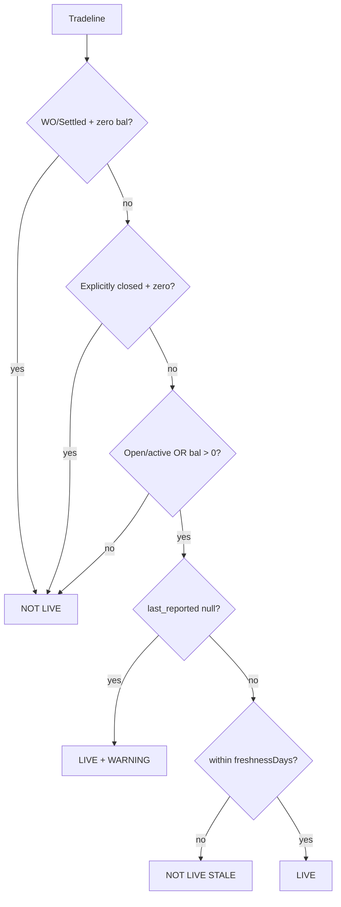

# 07 — Bureau Taxonomy and Metrics

## Taxonomy (EQUIFAX_TAXONOMY_V1)

Seeded in Flyway V89 (`ci_bureau_product_mapping`).

- Resolve by `provider_product_code` first, then description fallback
- Unknown code/description → `UNKNOWN`, `secured=null`
- **UNKNOWN must not count as unsecured**
- `secured=null` (unknown security) also excluded from live-unsecured count

## Live account definition (BUREAU_LIVE_ACCOUNT_DEFINITION_V1)

LIVE when all hold:

1. Account status is not explicitly closed (Closed/CLOSED/Settled terminal with zero balance and no open indicator)
2. AND (active/open status OR `current_balance > 0`)
3. AND not (written_off OR settled) unless still showing positive balance with active status  
   **Assumption:** written-off/settled with zero balance = NOT LIVE
4. AND `last_reported_date` within `freshnessDays` (default 365)  
   OR `last_reported_date` null → still LIVE if open/balance, quality flag `WARNING`

## Metrics (V1)

| Metric code | Notes |
|-------------|-------|
| `bureau.live_unsecured_loan_count` | LIVE && secured==false && category!=UNKNOWN && not duplicate |
| `bureau.total_live_exposure` | Sum balance on LIVE (non-duplicate) |
| `bureau.secured_live_exposure` / `unsecured_live_exposure` | Filtered by secured flag |
| `bureau.total_monthly_obligation` | Sum provider EMI only; never invent EMI %; PARTIAL if some missing |
| `bureau.max_dpd_12m` / `max_dpd_24m` | From payment history months; if no PH → DATA_INSUFFICIENT (aggregate DPD flags in evidence only) |
| `bureau.recent_inquiries_90d` | From inquiry list; 30d aggregate alone → DATA_INSUFFICIENT |
| `bureau.settled_account_count` / `written_off_account_count` | Status counts |

### live_unsecured outcomes

| Extraction | Result |
|------------|--------|
| `MISSING` / `FAILED` / `ABSENT` or `tradelinesPresent=false` | `DATA_INSUFFICIENT`, value=`null` (not zero) |
| `EMPTY` with tradelinesPresent=true | value=`0`, outcome PASS (valid zero) |
| OK with accounts | count with include/exclude refs |

## Duplicate detection

Match on:

- same `provider_tradeline_ref`, OR
- lender + opened_date + sanctioned_amount + account_type

Never lender+amount alone. Keep first as selected canonical; mark duplicates.

## Limitations

- Commercial bureau not implemented (Equifax consumer only)
- Equifax AccountType often description-only (no AccountTypeCode) — taxonomy uses description contains match
- Coded PaymentHistory strings without History48Months → PARTIAL quality, no month rows
- Individual inquiries often absent (summary only) → inquiries_90d may be DATA_INSUFFICIENT
