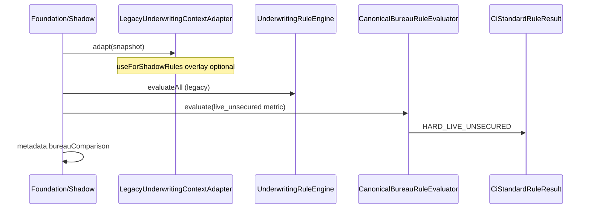

# 08 — Bureau Shadow Comparison

## Goals

Compare **legacy-compatible shadow** (existing engines via fact adapter) with **canonical bureau shadow** (`HARD_LIVE_UNSECURED`) without changing authoritative decisions.

## Flow

## Adapter behaviour (`use-for-shadow-rules`)

| Canonical metric | Adapter scorecard |
|------------------|-------------------|
| Available with value | Set `LIVE_UNSECURED_LOAN_COUNT` from canonical |
| `DATA_INSUFFICIENT` | Keep legacy compat value; flags `canonicalDataInsufficient=true`, `fallbackUsed=true` |
| Flag off | No overlay (legacy parity only) |

## Canonical rule HARD_LIVE_UNSECURED_V1

- PASS if value != null && value <= threshold (default 6)
- FAIL if value != null && value > threshold
- DATA_INSUFFICIENT if metric outcome is DATA_INSUFFICIENT
- Frozen versions: rule `HARD_LIVE_UNSECURED_V1`, metric `V1`, taxonomy `EQUIFAX_TAXONOMY_V1`, live def `BUREAU_LIVE_ACCOUNT_DEFINITION_V1`

## Mismatch classifications

Persisted under shadow evaluation `metadata.bureauComparison.mismatchClassifications`:

- `LEGACY_DEFAULT_USED`
- `LEGACY_MANUAL_VALUE`
- `CANONICAL_TRADELINE_COUNT_DIFFERENT`
- `CANONICAL_DATA_INSUFFICIENT`
- `UNKNOWN_PRODUCT_CLASSIFICATION`
- `DUPLICATE_REMOVED`
- `STALE_REPORT`
- `PARSER_DIFFERENCE`
- `OTHER`

## Admin API

`GET /api/v1/internal/credit-intelligence/bureau/applications/{id}/legacy-vs-canonical`

Requires same `X-Internal-Token` as Phase F.
