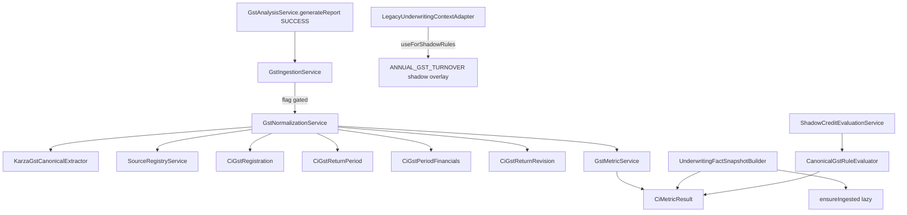

# 10 — GST Canonicalization (Phase C2)

## Purpose

Introduce provider-neutral GST registration / return-period / financials persistence and deterministic GST metrics **behind feature flags**, without changing production underwriting (including SCF `ANNUAL_GST_TURNOVER` gap defaults in `CreditControlService`).

## Investigation findings (verified before implementation)

| Finding | Implication |
|---------|-------------|
| Karza GST analysis via `GstAnalysisService.generateReport` → `GstAnalysisMapper.mapMetrics` → `KycStepResult.parsedData` | Canonical extractor reads `fullResponse.result` / `result`; production mapper left stable |
| Scorecard keys: `ANNUAL_GST_TURNOVER`, `GST_INCOME`, `avgGmv3m`, `active90days` | Compat metadata uses `compatibilitySource`; production scorecard not overwritten |
| SCF fills `ANNUAL_GST_TURNOVER` to 52M if missing/zero or &lt; 50M | **Do not change** `CreditControlService`; shadow eligibility consumes canonical `gst.turnover.trailing_12m` only |
| Karza `monthWiseSummary[].retPeriod` = MMYYYY (e.g. `"042026"`); `gstr1.ttlVal` | `GstPeriodUtils` + `KarzaGstCanonicalExtractor` |
| GSTR3B amounts not read by production mapper | Extractor looks for `gstr3b.ttlVal` when present |
| Flyway V90 (tables) + V91 (facts/metrics) already written | Entities match V90; no new migrations |
| Phase C1 bureau package at `com.los.core.creditintelligence.bureau` | Mirrored under `.gst` |
| `SourceType.GST` already exists | Used for source registry |

## Architecture



## Packages

`com.los.core.creditintelligence.gst`

- `domain` — enums + JPA entities (V90)
- `repository` — Spring Data repos
- `util` — period / filing status / freshness
- `provider` — `KarzaGstCanonicalExtractor` (`KARZA_GST_PARSER_V1`)
- `service` — normalize, metrics, ingestion, shadow rule evaluator
- `api` — `GstCanonicalAdminController`

## Feature flags

```yaml
credit-intelligence:
  canonicalization:
    gst:
      enabled: false
      tenant-ids: []
      product-codes: []
      use-for-shadow-rules: false
      persist-periods: true
      min-months-for-annualization: 6
      gstr1-gstr3b-variance-warning-pct: 5.0
      gstr1-gstr3b-variance-material-pct: 15.0
      min-completeness-for-trailing-12m: 0.75
      filing-lag-days: 20
      turnover-eligibility-threshold: 50000000
```

## Safety constraints

- Production underwriting / `CreditControlService` gap defaults unchanged
- Missing GST → `DATA_INSUFFICIENT`, `value=null` — never invent turnover 0 from parse failure
- Valid zero-turnover month ≠ missing month
- Do not silently annualize incomplete data; annualized metric never substitutes for trailing_12m
- No raw Karza JSON in ordinary logs or fact tables (artifact ref `kyc_step_result:{id}` only)
- Canonicalization failures never fail GST report generation

## Hook point

After successful REPORT `KycStepResult` save in `GstAnalysisService.generateReport`:

```java
gstIngestionService.ingestFromReport(app, step.getParsedData(), requestId, step.getId());
```

Snapshot build may call `ensureIngested(applicationId)` when flag on and not yet ingested.

## Related docs

- `11_gst_metrics_and_filing_semantics.md`
- `12_gst_shadow_comparison.md`
- `13_phase_c2_validation_report.md`
