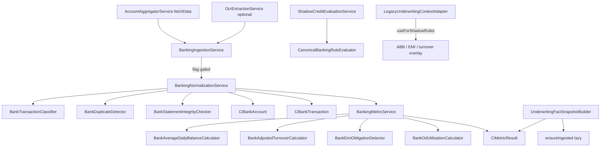

# 14 — Banking / AA Canonicalization (Phase C3)

## Purpose

Introduce provider-neutral bank account / transaction / obligation / quality persistence and deterministic banking metrics **behind feature flags**, without changing production underwriting (including CreditControl gap defaults for `AVERAGE_BANK_BALANCE`, `EMI_OBLIGATION`, `ANNUAL_BANKING_TURNOVER`, cheque bounces, CC utilisation).

## Investigation findings (verified before implementation)

| Finding | Implication |
|---------|-------------|
| AA: `AccountAggregatorService.fetchData` → `AaFiDataParser` summary on `aa_consents.fetched_data_summary` | Hook after save; simulation default ON |
| Summary had accounts + avg inflow/outflow + regularEmiOutflows + bounceCount6Months — **no transactions** | Extended `simulatedSummary()` with ~180d transactions; `parseSetuFiPayload` collects FI `Transactions` when present |
| Bank OCR stub in `OcrExtractionService.extractBankStatement` | Optional ingest hook; CreditControl mapping unchanged |
| Gap defaults: ABB=120000, EMI=15000, turnover=41M, bounces=2, CC=70 | **Do not change** `CreditControlService` |
| Legacy keys: `AVERAGE_BANK_BALANCE`, `BANK_STATEMENT_INCOME`, `ANNUAL_BANKING_TURNOVER`, `EMI_OBLIGATION`/`MONTHLY_OBLIGATION`, `CHEQUE_BOUNCES_*`, `CC_UTILISATION_PCT` | Compat metadata only; no invented literal keys |
| Flyway V92 (tables) + V93 (facts/metrics) already written | Entities match V92; no new migrations |
| Phase C1/C2 packages under `bureau` / `gst` | Mirrored under `.banking`; reuse `CiMetricResult` |

## Architecture



## Packages

`com.los.core.creditintelligence.banking`

- `domain` — enums + JPA entities (V92)
- `repository` — Spring Data repos
- `service` — classifier, calculators, normalize, metrics, ingestion, shadow rules
- `api` — `BankingCanonicalAdminController`

## Feature flags

```yaml
credit-intelligence:
  canonicalization:
    banking:
      enabled: false
      tenant-ids: []
      product-codes: []
      use-for-shadow-rules: false
      persist-transactions: true
      min-statement-completeness: 0.7
      min-classification-coverage: 0.5
      emi-min-occurrences: 3
      emi-regularity-threshold: 0.7
      od-utilisation-warning-pct: 90
      cash-deposit-ratio-warning-pct: 0.3
      abb-minimum: null
      cheque-return-max-3m: 0
      nach-return-max-3m: 0
```

## Safety constraints

- Production underwriting / CreditControl gap defaults unchanged
- Missing data → `DATA_INSUFFICIENT` / null — never invent ABB=0 or EMI from thin air in canonical path
- Valid zero (e.g. no bounces with complete txns) ≠ missing
- Hash account numbers; last4 only; no AA secrets in metadata
- EvidenceGroup for large txn ID lists (sample + count when &gt; 20)
- Deterministic pattern classifier only (no AI)
- Canonicalization failures never fail AA fetch

## Hook point

After `setFetchedDataSummary` + save in `AccountAggregatorService.fetchData`:

```java
bankingIngestionService.ingestFromAaConsent(consent, app);
```

Snapshot build may call `ensureIngested(applicationId)` when flag on and not yet ingested.

## Related docs

- `15_bank_transaction_taxonomy.md`
- `16_banking_metrics_and_obligations.md`
- `17_banking_shadow_comparison.md`
- `18_phase_c3_validation_report.md`
