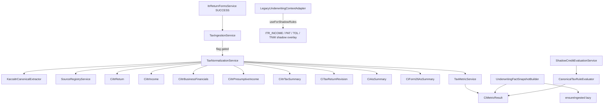

# 19 — Tax Canonicalization (Phase C4)

## Purpose

Introduce provider-neutral ITR / AIS / Form 26AS persistence and deterministic tax metrics **behind feature flags**, without changing production underwriting (including SCF `SCF_GAP_ITR_INCOME` and related gap defaults in `CreditControlService`).

## Investigation findings (verified before implementation)

| Finding | Implication |
|---------|-------------|
| Only Karza ITR return-forms via `ItrReturnFormsService.submitCredentials` → `ItrReturnFormsMapper.mapMetrics` → `KycStepResult` | Canonical extractor reads `result` Map; production mapper left stable |
| Scorecard keys: `ITR_INCOME` (← totalRevenue), `PAT`, `EBITDA`, `DEBT_SERVICE`, `TOL`, `TNW`, … | Compat metadata for ITR_INCOME / PAT / EBITDA / TOL / TNW; no ANNUAL_INCOME / NET_WORTH / TOTAL_BORROWINGS literals |
| Gap defaults `SCF_GAP_ITR_INCOME=450000` etc. | **Do not change** `CreditControlService` |
| No AIS or 26AS production code | Model tables/APIs/metrics for future; extractor parses if present |
| `SourceType.ITR` exists; `AIS` / `FORM_26AS` on enum | Used for source registry |
| Flyway V94 (tables) + V95 (facts/metrics) already written | Entities match V94; no new migrations |
| Phase C2/C3 packages under `.gst` / `.banking` | Mirrored under `.tax` |
| Reuse `CiMetricResult` | Shared metric table with `itr.*` / `xsrc.itr_*` codes |

## Architecture



## Packages

`com.los.core.creditintelligence.tax`

- `domain` — enums + JPA entities (V94)
- `repository` — Spring Data repos
- `util` — FY/AY, form normalize, effective return, freshness
- `provider` — `KarzaItrCanonicalExtractor` (`KARZA_ITR_PARSER_V1`)
- `service` — normalize, metrics, ingestion, shadow rule evaluator
- `api` — `TaxCanonicalAdminController`

## Feature flags

```yaml
credit-intelligence:
  canonicalization:
    tax:
      enabled: false
      tenant-ids: []
      product-codes: []
      use-for-shadow-rules: false
      persist-detail: true
      min-years-for-growth: 2
      itr26as-variance-warning-pct: 10.0
      itr26as-variance-material-pct: 25.0
      itr-ais-variance-warning-pct: 10.0
      itr-ais-variance-material-pct: 25.0
      min-income-threshold: 300000
      min-turnover-threshold:
      min-pat-positive: true
```

## Safety constraints

- Production underwriting / gap defaults unchanged
- Missing fields → null / `DATA_INSUFFICIENT` / `NOT_APPLICABLE` — never invent zeros
- Presumptive (ITR-4 / 44AD) separate from EBITDA/BS ratio rules
- Hash PAN (last4 only in clear); no raw passwords/payloads in logs or fact tables
- Artifact ref `kyc_step_result:{id}`
- Canonicalization failures never fail ITR pull

## Hook point

After SUCCESS save in `ItrReturnFormsService.submitCredentials` (with mappedMetrics), call `taxIngestionService.ingestFromItrStep` (catch-all).
