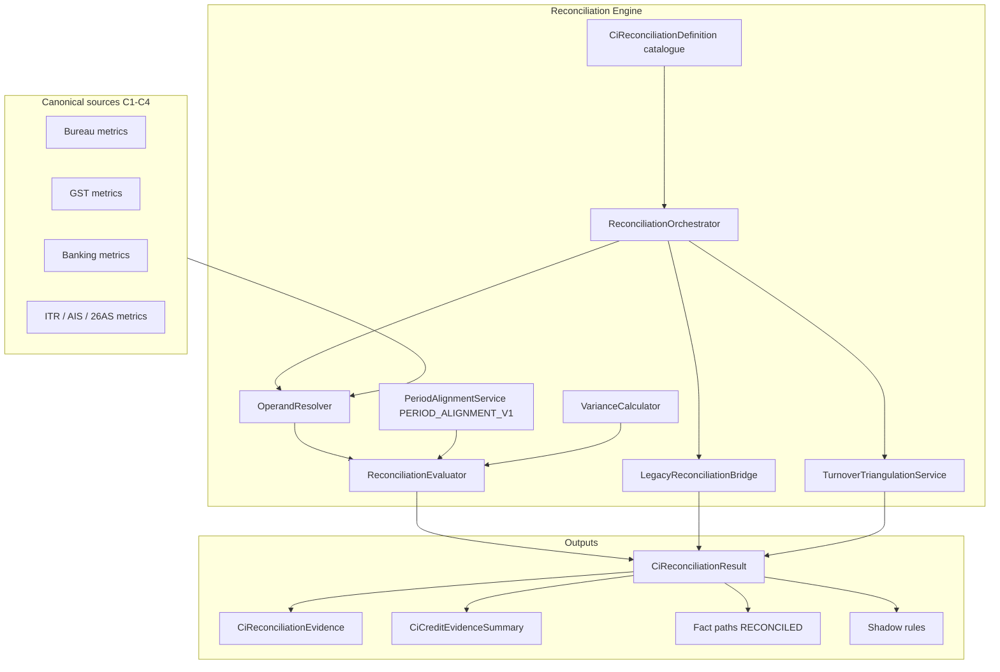
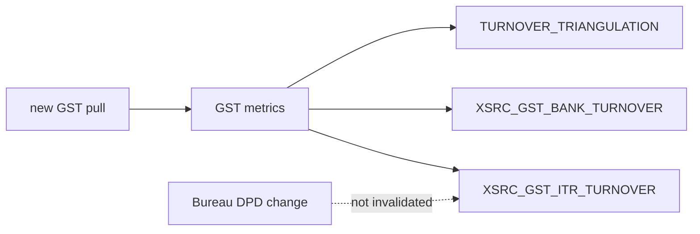

# 24 — Cross-Source Reconciliation Engine

Phase C5 introduces a **generic, definition-driven** reconciliation engine under `com.los.core.creditintelligence.reconciliation`.

## Architecture

## Design principles

- Shadow-only, flag-gated (`credit-intelligence.reconciliation.*`)
- Consume existing `CiMetricResult` codes — do not recreate GST/ITR/Bank/Bureau metrics
- Missing operands → `DATA_INSUFFICIENT` / `PERIOD_MISMATCH` — never invent values
- Turnover mismatches favor explain → refer → investigate (not hard-fail)
- Evidence strength is **not** a credit/risk score
- Orchestration never throws into the production underwriting path

## Package layout

| Area | Package |
|------|---------|
| Domain / enums | `…reconciliation.domain` |
| Repositories | `…reconciliation.repository` |
| Engine | `…reconciliation.service` |
| Admin API | `…reconciliation.api` |

## Selective re-evaluation

Definitions carry `dependency_metric_codes`. When `changedMetricCodes` is supplied, only dependent reconciliations (plus triangulation when turnover deps change) re-run.

