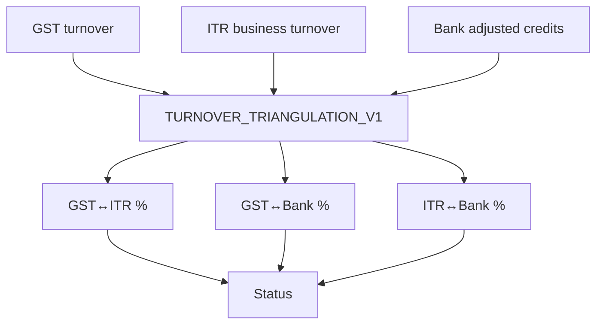

# 25 — Turnover Reconciliation

## Pairwise codes

| Code | Left | Right | Alignment | Variance |
|------|------|-------|-----------|----------|
| `XSRC_GST_ITR_TURNOVER` | `gst.turnover.trailing_12m` | `itr.business.turnover.latest_fy` | COMMON_OVERLAP | SYMMETRIC_PERCENT_DIFFERENCE |
| `XSRC_GST_BANK_TURNOVER` | GST trailing 12m | `banking.adjusted_business_credits_12m` (+6m fallback) | COMMON_OVERLAP | SYMMETRIC |
| `XSRC_ITR_BANK_TURNOVER` | ITR business turnover | bank adj credits | FINANCIAL_YEAR | SYMMETRIC |
| `XSRC_GSTR1_GSTR3B_TURNOVER` | Legacy C2 wrap | same metric evidence | COMMON_OVERLAP | PERCENT_OF_MAX |

Default tolerances (config): match 1% · warning 5% · material 15% (`TURNOVER_TOLERANCE_V1`).

## Presumptive ITR

When `CiItrReturn.itrForm` is ITR-4 or presumptive rows exist, GST↔ITR / ITR↔Bank turnover returns `DATA_INSUFFICIENT` with `PRESUMPTIVE_ITR` — not a fabricated variance.

## Triangulation

Statuses: `STRONG_ALIGNMENT` · `REASONABLE_ALIGNMENT` · `REVIEW_REQUIRED` · `MATERIAL_CONFLICT` · `DATA_INSUFFICIENT`

Synthesis is **not** an average of the three amounts.
