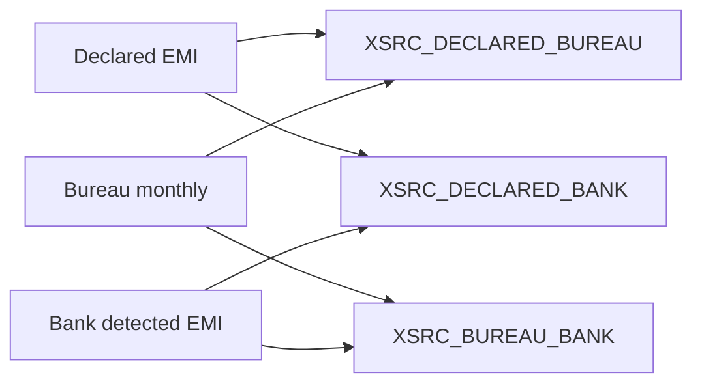

# 26 — Obligation Reconciliation

## Codes

| Code | Left | Right |
|------|------|-------|
| `XSRC_BUREAU_BANK_OBLIGATION` | `bureau.total_monthly_obligation` | `banking.monthly_obligation` |
| `XSRC_DECLARED_BUREAU_OBLIGATION` | `compat.EMI_OBLIGATION` (+ `MONTHLY_OBLIGATION`) | bureau obligation |
| `XSRC_DECLARED_BANK_OBLIGATION` | declared EMI | bank monthly obligation |

Alignment: `EXACT_PERIOD`. Variance: symmetric %. Tolerances: match 2% · warning 5% · material 20% (`OBLIGATION_TOLERANCE_V1`).

Lender-level matching remains a probable-cause / review signal (`UNKNOWN_LENDER_MATCH`); C5 does not invent matched tradelines.
