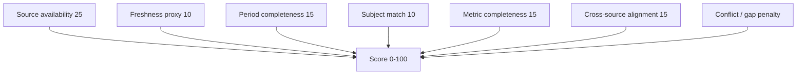

# 27 — Credit Evidence Strength

## What it is

`credit.evidence_strength_score` (0–100) + grade (`STRONG` / `ADEQUATE` / `WEAK` / `INSUFFICIENT`).

**Not a credit score. Not a risk score.** A borrower can have strong evidence and weak credit quality (or the reverse).

Method: `EVIDENCE_STRENGTH_V1`.

## Components

Persisted on `CiCreditEvidenceSummary` with turnover / obligation / income / tax / quality JSON blocks.

Feature flag: `credit-intelligence.reconciliation.evidence-strength.enabled` (defaults false; score still computed when recon runs for shadow/admin).
