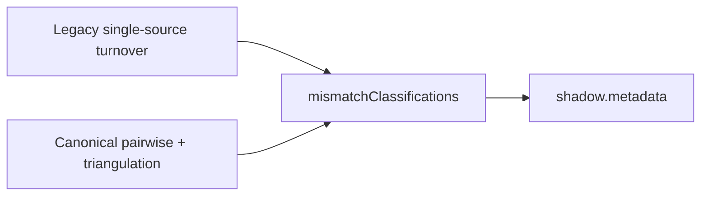

# 28 — Reconciliation Shadow Rules

## Engine

`CanonicalReconciliationRuleEvaluator` — shadow-only.

| Reconciliation outcome | Rule outcome |
|------------------------|--------------|
| MATCH | PASS |
| ACCEPTABLE_VARIANCE | PASS (WARN optional) |
| MATERIAL_VARIANCE | REFER |
| CONFLICT | REFER |
| DATA_INSUFFICIENT | DATA_INSUFFICIENT |

Rules: `XSRC_GST_ITR_TURNOVER`, `XSRC_GST_BANK_TURNOVER`, `XSRC_ITR_BANK_TURNOVER`, `XSRC_BUREAU_BANK_OBLIGATION`, `XSRC_DECLARED_*`, `XSRC_TURNOVER_TRIANGULATION`.

## Shadow metadata

`ShadowCreditEvaluationService` writes:

- `reconciliationComparison` — rules, legacy vs triangulated turnover, mismatch classifications
- `creditEvidenceSummary` — strength score/grade, conflicts, gaps

Production CreditControl / scorecard / gap defaults remain unchanged.
