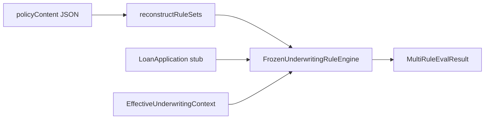

# 32 — Frozen Policy Execution

## Adapter

`FrozenPolicyExecutionAdapter` reconstructs transient `UnderwritingRuleSet` / `UnderwritingScorecard` objects from `CiPolicyVersion.policyContent` and evaluates via `FrozenUnderwritingRuleEngine` — **no live DB rule lookup**.

## Purity property

Mutating live `rulesJson` in the database (or an in-memory “live” copy) must not change evaluation driven by the original frozen `policyContent`.

## Flag

`credit-intelligence.frozen-policy-execution.enabled` (default **false**).

## Tests

`FrozenPolicyExecutionAdapterTest`.
