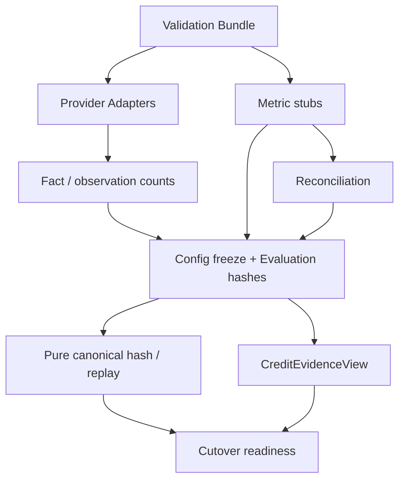

# 37 — Multi-Source Validation

## Purpose

Phase C6 proves the non-authoritative pipeline:

```text
Provider Fixture → Adapter SPI → Facts → Metric stubs → Reconciliation
  → EvaluationContext hashes → Frozen policy shadow → Replay → Credit Evidence
```

Production underwriting (status, CAM, sanction, CreditControl) is **unchanged**.

## Bundle format

Classpath: `validation-bundles/<case>/bundle.json`

| Case | Directory | Origin |
|------|-----------|--------|
| CASE_A_STRONG | `case_a_strong` | REPRESENTATIVE_PROVIDER_FIXTURE |
| CASE_B_LEGACY_DEFAULT | `case_b_legacy_default` | REPRESENTATIVE_PROVIDER_FIXTURE |
| CASE_C_TURNOVER_CONFLICT | `case_c_turnover_conflict` | REPRESENTATIVE_PROVIDER_FIXTURE |
| CASE_D_OBLIGATION_CONFLICT | `case_d_obligation_conflict` | REPRESENTATIVE_PROVIDER_FIXTURE |
| CASE_E_INCOMPLETE | `case_e_incomplete` | REPRESENTATIVE_PROVIDER_FIXTURE |

Bundles compose C5.1 `USER_SUPPLIED_SAMPLE` fixtures under `provider-fixtures/` plus representative metric stubs. Never labelled live.

## Pipeline



## Harness

`MultiSourceValidationHarness` orchestrates cases. Flag: `credit-intelligence.validation.enabled` (default **false**).

## APIs

Internal (X-Internal-Token):

- `GET/POST /api/v1/internal/credit-intelligence/validation/runs`
- Application evidence / policy-comparison / cutover-readiness endpoints

No raw provider payloads.
