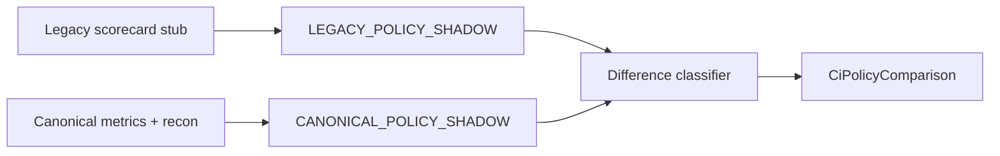

# 38 — Legacy vs Canonical Policy Comparison

## Modes

| Mode | Defaults | Missing data |
|------|----------|--------------|
| LEGACY_POLICY_SHADOW | Gap/demo defaults allowed | Silent fill |
| CANONICAL_POLICY_SHADOW | No silent defaults | DATA_INSUFFICIENT / REFER |

Both are **non-authoritative**.

## Difference classes

MATCH, CANONICAL_STRICTER, CANONICAL_MORE_PERMISSIVE, CANONICAL_DATA_INSUFFICIENT, LEGACY_DEFAULT_DEPENDENT, LEGACY_MANUAL_DEPENDENT, CANONICAL_EVIDENCE_CONFLICT, POLICY_BINDING_MISSING, OTHER

## Highlights

- **CASE_B**: LIVE_UNSECURED / ABB / banking rules → `LEGACY_DEFAULT_DEPENDENT` (legacy gap-defaults; canonical DI).
- **CASE_C**: Turnover triangulation → `CANONICAL_EVIDENCE_CONFLICT` / REFER with explanation (not auto-fraud).
- **CASE_D**: EMI bureau vs bank → evidence conflict + lender match signals.
- **CASE_E**: Banking absent → DI, not fabricated pass.

## Bindings

`PolicyBindingCatalog.seedDefaults(tenantId)` maps LIVE_UNSECURED_LOAN_COUNT, ANNUAL_GST_TURNOVER, AVERAGE_BANK_BALANCE, ANNUAL_BANKING_TURNOVER, EMI_OBLIGATION, ITR_INCOME, PAT, TOL, TNW, OBLIGATION_RATIO, etc. Ready flags remain **false** until cutover gates pass.
