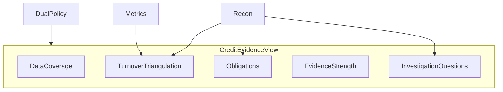

# 39 — Credit Evidence View

Underwriter-oriented deterministic read model produced by `CreditEvidenceViewBuilder`.

## Sections

1. DataCoverage  
2. Identity  
3. Bureau  
4. Banking  
5. GST  
6. ITR  
7. Obligations  
8. TurnoverTriangulation  
9. MaterialReconciliations  
10. DataQuality  
11. EvidenceStrength  
12. LegacyVsCanonical  
13. OpenInvestigationQuestions  



## Example (CASE_A style)

```text
GST                    ₹8.40 Cr
ITR                    ₹8.10 Cr
Bank credits           ₹7.70 Cr
Evidence Strength      STRONG
```

Questions are deterministic templates from MATERIAL_VARIANCE / CONFLICT / DI — no AI in C6.

API: `GET /api/v1/internal/credit-intelligence/applications/{id}/credit-evidence`
