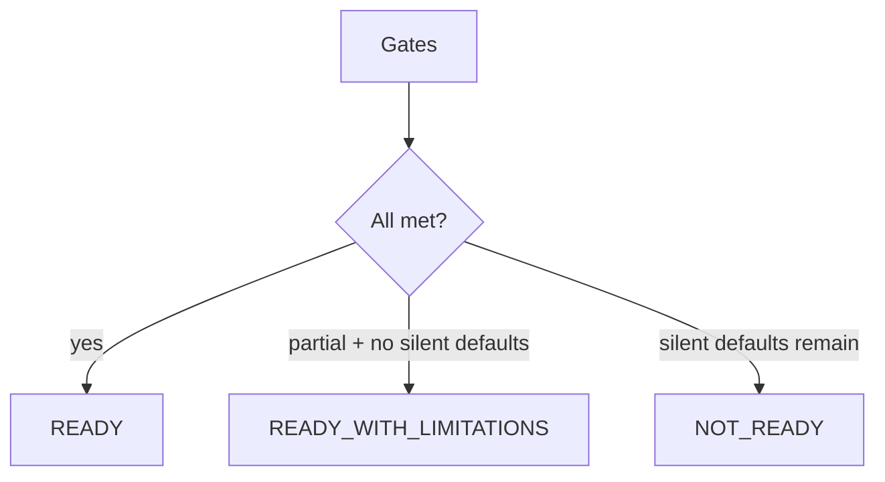

# 40 — Policy Cutover Readiness

## Gates (all required for READY)

| Gate | Requirement |
|------|-------------|
| Replay purity | deterministicEvaluationHash stable after live mutation |
| Critical coverage | 100% or approved missing policy |
| Silent defaults | 0 on proposed cutover rules |
| Binding coverage | 100% ready for scope |
| Tenant isolation | pass |
| Provider fixtures | pass |
| Multi-source | pass |
| Security critical | 0 open |

## Honest C6 outcome

**NOT_READY** (or at best READY_WITH_LIMITATIONS only if silent defaults were zero — they are not).

Production `CreditControlService` still applies GAP_DEFAULT / SCF_GAP / DEMO_FALLBACK. Canonical CI is shadow-only.

### Blockers

- Silent default inventory still active in production underwriting
- Critical binding `ready=false` by design until defaults removed
- Critical-input coverage &lt; 100% on thin/incomplete cases

### P0 / P1

| Track | May begin? |
|-------|------------|
| P0 AI Policy Studio **design** | **Yes** — registry + ambiguity catalog exist |
| P1 Policy Engine modernization (authority) | **No** — cutover NOT_READY |
