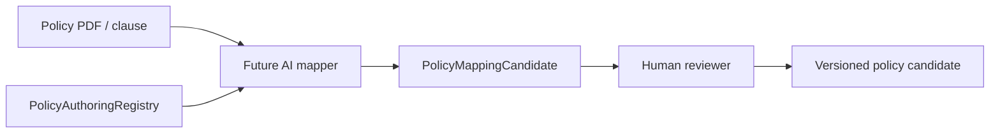

# 41 — Policy Authoring Registry

Design-only vocabulary for a future AI Policy Studio. **No AI invocation in C6.**

## Contents (`PolicyAuthoringRegistry`)

- Canonical facts  
- Metrics (with period functions)  
- Reconciliations  
- Operators  
- Outcomes  
- Classifications  
- Product scopes  

Schema: `POLICY_AUTHORING_REGISTRY_V2`

Extended fields per metric/fact: `canonicalPath`, `type`, `description`, `unit`, `periodSemantics`, `allowedOperators`, `subject`, `sourceRequirements`, `classificationRequirements`, `availability`.

Banking/Bureau BRE paths include `banking.avg_daily_balance_3m`, settlement metrics (may be `UNAVAILABLE`), `bureau.score`, `bureau.max_dpd_6m`, `bureau.inquiries.current_month`, `application.proposed_edi`.



## Ambiguity model (`PolicyAmbiguityCatalog`)

```text
PolicyMappingCandidate {
  clauseId, phrase, possibleCanonicalPaths[], confidence[],
  selectedPath, selectionSource, reviewer
}
```

Example ambiguous phrases: "Average monthly transactions", "EDI", "Clean string", "large credits", "bulk deposition".
