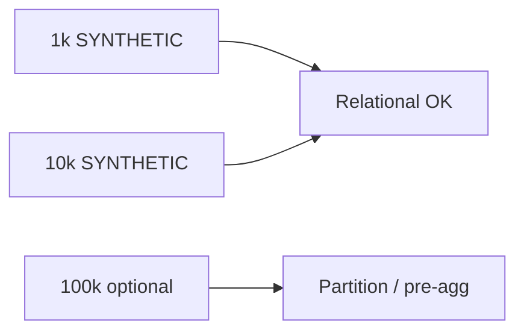

# 42 — C6 Performance and Scale

## Harness

`ValidationPerformanceHarness` — **SYNTHETIC** bank txn sizes (1k, 10k by default). Does not call live providers.

Measured stages: synthesize, normalize/aggregate, metric, reconciliation, total; heap snapshot.

## Recommendation (C6)

| Volume | Recommendation |
|--------|----------------|
| ≤10k txn / appraisal window | Retain relational store; V98 indexes sufficient |
| Growth path | Pre-aggregated monthly metrics now |
| 100k+ | Partition later by month/tenant; consider hot/cold + object-store archival when evidence warrants |

Do **not** adopt distributed infrastructure without measured need. Partition **later** vs now: **later**, unless production volumes already exceed ~100k active txns per hot tenant window.

