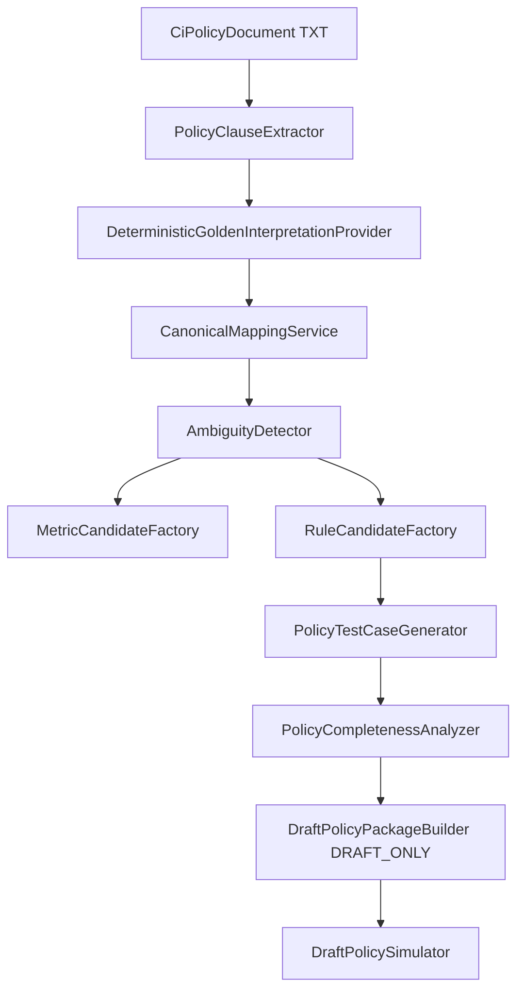
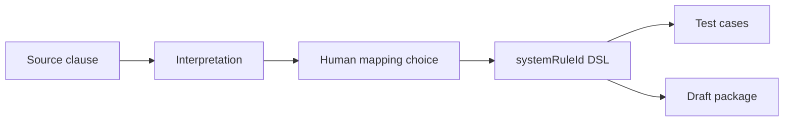

# 44 — AI Policy Studio (P0)

## Purpose

Authoring and governance pipeline:

```text
Customer policy document
  → Clause extraction
  → Policy interpretation
  → Canonical mapping candidates
  → Ambiguity detection
  → Human mapping review
  → Draft executable policy
  → Generated tests
  → Simulation (VALIDATION_FIXTURE_SIMULATION)
  → Maker-checker readiness
```

**Never** production-active. Draft packages are `DRAFT_ONLY` only. Production underwriting unchanged.

## Package

`com.los.core.creditintelligence.policystudio`

## Feature flags (default false)

```yaml
credit-intelligence.policy-studio.enabled: false
credit-intelligence.policy-studio.ai-enabled: false
credit-intelligence.policy-studio.tenant-ids: []
credit-intelligence.policy-studio.require-maker-checker: true
```

## Pipeline



## Lineage



## APIs

Internal only: `/api/v1/internal/credit-intelligence/policy-studio/...` + `X-Internal-Token`.

## Interpretation

P0 uses `DeterministicGoldenInterpretationProvider` for Banking/Bureau BRE. Optional `StubLlmInterpretationProvider` only when `ai-enabled=true`.
