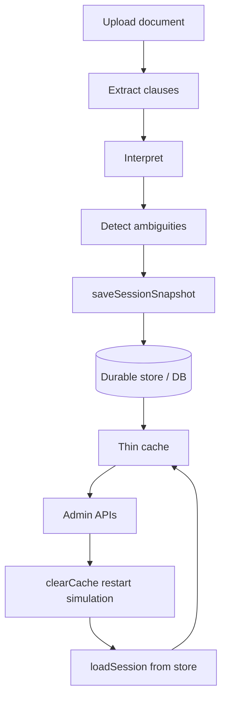

# 50 — Policy Studio Persistence (P0.1)

## Purpose

Persistent authoring sessions so Policy Studio survives process restart without losing clause/rule/ambiguity state.

## Lifecycle

## Entities (V101)

- `CiPolicyAuthoringSession` — session row with `@Version`
- `CiPolicyParameter` — e.g. `PROPOSED_EDI`
- `CiPolicySimulationRun` — VALIDATION_FIXTURE_SIMULATION rows
- `CiPolicyDraftDiff` — package version diffs

Optimistic locking columns also on ambiguity, rule, test, document, vocabulary, draft package.

## Service

`PolicyStudioPersistenceService`

- `saveSessionSnapshot` / `loadSession` / `loadSessionBySessionId`
- In-memory durable store for unit tests; JPA repos available under Spring
- `clearCache()` simulates restart; durable store retained

## Constraint

Never activates production policy. Draft packages remain `DRAFT_ONLY`.
