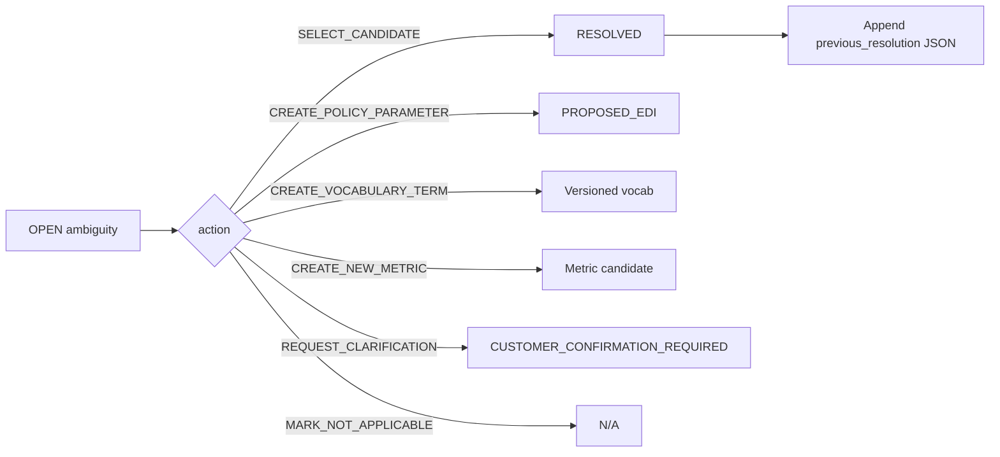

# 51 — Policy Vocabulary and Ambiguity (P0.1)

## Ambiguity resolution

AI history is **appended** to `previous_resolution` — never overwritten.

## Vocabulary learning

`PolicyVocabularyService.approveTerm(GLOBAL|TENANT|PRODUCT)`

- Versions prior ACTIVE → SUPERSEDED
- Next interpret **proposes** prior mapping first (`proposeFirst=true`)
- Does **not** auto-finalize

## EDI

Unresolved by default. If vocabulary does not resolve → `CREATE_POLICY_PARAMETER` creates `PROPOSED_EDI` (`POLICY_PARAMETER_REF`). Do not guess.

## Exactly-100

Human must select: treat as percentage / count / separate rule / ask customer. Selection regenerates inward-return boundary tests.
