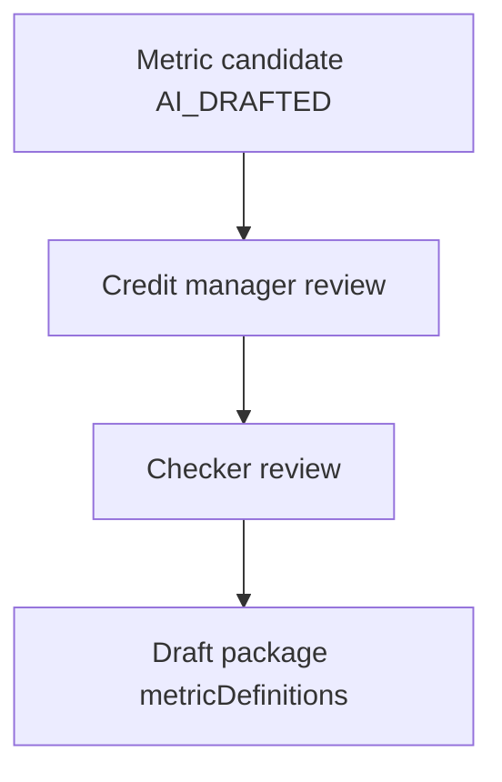

# 52 — Customer Policy Metrics (P0.1)

## Metric candidate approval

## Banking (PolicyBankingMetricService)

| Metric | Behaviour |
|--------|-----------|
| QR settlement suite | DI if taxonomy cannot identify QR |
| transaction_count_3m / average_monthly_* | DI if classification coverage insufficient |
| inward cheque return count/ratio | ratio DI if denominator missing |
| emi_bounce / intercompany / large_credit / online_gaming | DI when coverage insufficient |
| BANK_POLICY_ADJUSTED_ADB_3M | Scoped exclusions; never mutates `banking.avg_daily_balance_3m`; bulk deposit needs resolved average-deposit definition |

## Bureau (PolicyBureauMetricService + BureauStatusNormalizer)

- max_dpd_6m, inquiries.current_month_count (EvaluationClock)
- consumer.score / ntc
- writeoff / overdue / status counts via canonical status
- pan_count, overdue.age_months, credit_after_overdue.exists
- clean_history_months → **DI until CLEAN vocabulary resolved**

Canonical statuses: NTC, DBT, PWOS, LSS, ACCOUNT_SOLD, SETTLED, RESTRUCTURED, LEGAL_SUIT, UNKNOWN.
