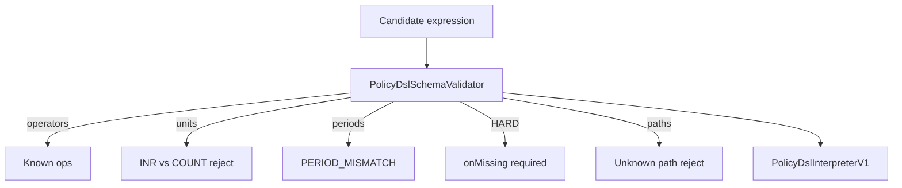

# 53 — Policy DSL V1 (P0.1)

## Compilation / validation

## Operand kinds

`FACT_REF` / `METRIC_REF` / `POLICY_PARAMETER_REF` / `APPLICATION_FIELD_REF` / `CONSTANT`

## Evaluation semantics (`POLICY_DSL_EVALUATION_SEMANTICS_V1`)

- AND(PASS, DI) = DI
- OR(PASS, DI) = PASS
- OR(FAIL, DI) = DI
- GTE(missing, x) = DI

Current month uses **EvaluationContext Clock** — never wall clock in the interpreter.
