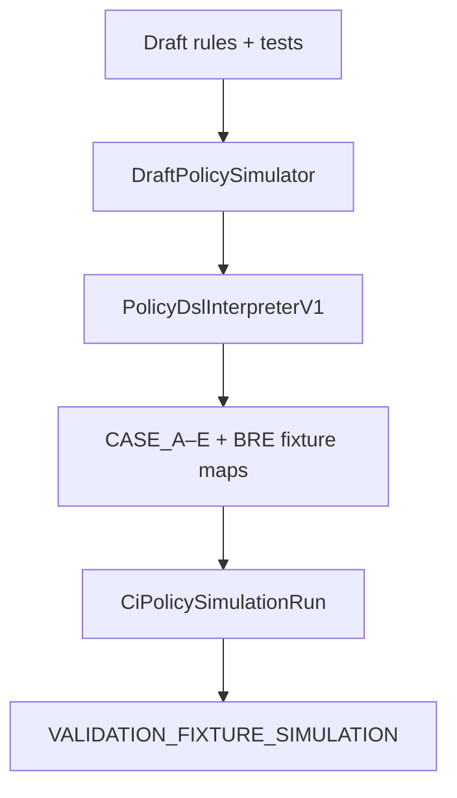

# 54 — Policy DSL Simulation (P0.1)

- Label: **VALIDATION_FIXTURE_SIMULATION**
- Not portfolio impact
- Persists `CiPolicySimulationRun` with DSL version + evaluation semantics
- Optional `EvaluationContext` fields / clock for inquiry-month cases
