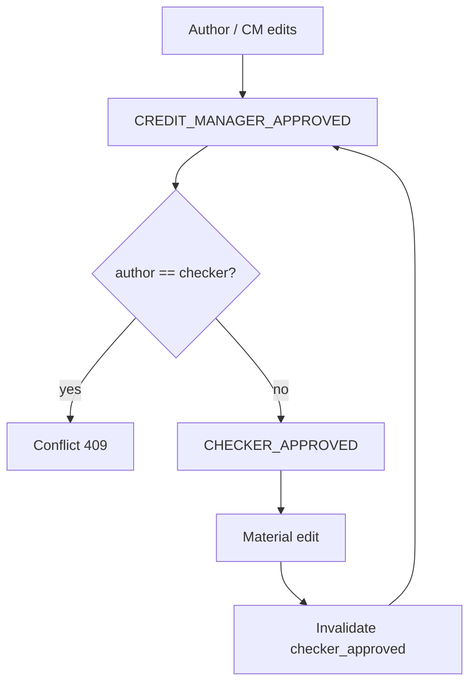
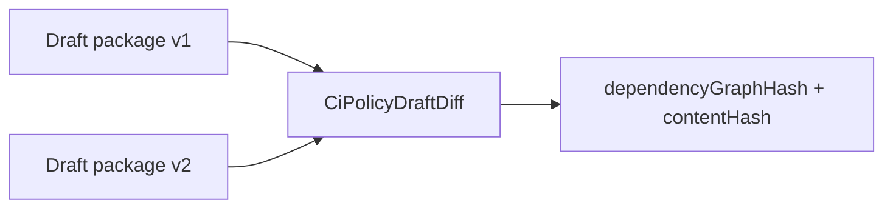

# 55 — Policy Review and Maker-Checker (P0.1)

## Rules

- Author ≠ final checker when `require-maker-checker=true`
- Material edit after checker approval → `invalidated_by_edit=true`
- `DraftPolicyPackageBuilder` rejects (strict) when:
  - material ambiguities remain
  - critical tests unapproved
  - blocking conflicts remain
  - canonical references missing

## Diff / preview / progress

- `DraftPolicyDiffService` — package V1 vs V2
- `PolicyPreviewService` — human-readable eligibility text
- `PolicyAuthoringProgressScorer` — 0–100 authoring readiness + DRAFT / NEEDS_REVIEW / BLOCKED / READY_FOR_POLICY_BUILD (**not** a credit score)

## Draft package versioning

