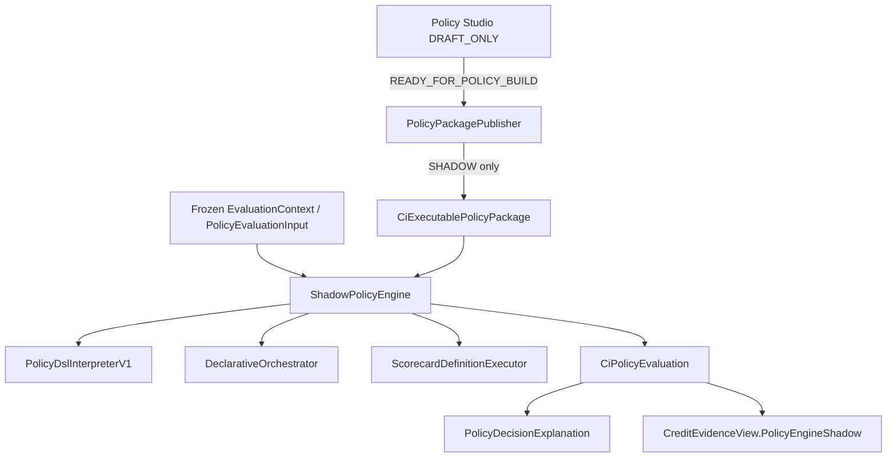

# 57 — Policy Engine Architecture (P1)

Shadow-only modernization of credit policy execution. Production underwriting authority is unchanged.

## Bounded context

`com.los.core.creditintelligence.policy`

| Concern | Owner |
|---------|-------|
| Authoring | Policy Studio |
| Publishing | PolicyPackagePublisher → SHADOW |
| Execution | ShadowPolicyEngine |
| Simulation / replay | PolicySimulationService / PolicyReplayService |
| Recommendation | PolicyEvaluationOutcome (not sanction) |

## Constraints

- Status used in P1: **SHADOW** (never ACTIVE authority)
- Single interpreter: `PolicyDslInterpreterV1`
- Feature flags `credit-intelligence.policy-engine.*` default **false**
- No CAM / sanction / VKYC / workflow / CreditControl gap-default changes
