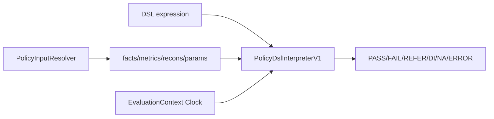

# 58 — Policy DSL Execution (P1)

## Single interpreter

Studio tests, simulation, shadow evaluation, and replay all use:

```text
PolicyDslInterpreterV1
POLICY_DSL_V1
POLICY_DSL_EVALUATION_SEMANTICS_V1
```



## Operators

AND, OR, NOT, IF · EQ, NE, GT, GTE, LT, LTE, BETWEEN · IN, NOT_IN · EXISTS, IS_MISSING · ADD, SUBTRACT, MULTIPLY, DIVIDE · COUNT, SUM, AVERAGE, MIN, MAX

## Refs

FACT_REF, METRIC_REF, RECON_REF, POLICY_PARAMETER_REF, APPLICATION_FIELD_REF, CONSTANT

## DEFAULTED

Hard rules: DEFAULTED → DATA_INSUFFICIENT unless `allowsDefaulted=true`. Legacy production behaviour unchanged.
