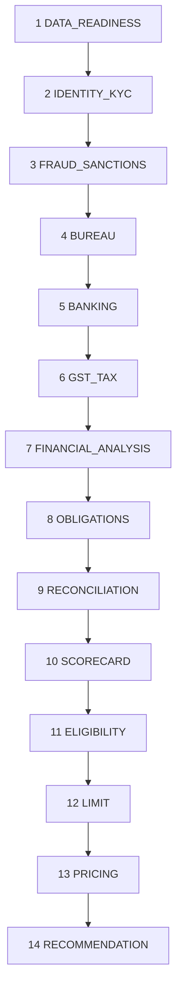

# 59 — Declarative Orchestration (P1)

Package-owned stages replace Java call-order as business logic.

## Stage fields

`stageCode`, `sequence`, `dependsOn`, `rules`, `continueOnFail`, `continueOnRefer`, `parallelizable`, `required`

## Semantics

- Knockout FAIL may stop later eligibility when `continueOnFail=false`
- Evidence / audit / explanation still collected for executed stages
- Default aggregation precedence (overridable by package): KNOCKOUT FAIL > HARD FAIL > REFER > DI > PASS
