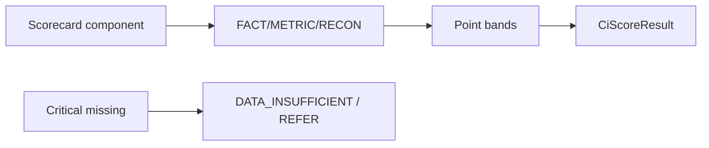

# 60 — Scorecard Modernization (P1)

Canonical shadow scorecards are package-defined components — not flat scorecard bag keys.

## ScorecardDefinition

`scorecardCode`, `version`, `components`, `weights`, `bands`, `missingDataPolicy`, `minScore`, `maxScore`, `riskGradeBands`

## Rules

- Missing bureau score ≠ silent zero points
- Critical missing → DI/REFER per definition
- `CiScoreResult`: score, grade, componentResults, weightUsed/Unavailable, dataCompleteness, reasonCodes

## Metrics registry (P1 demo)

FOIR, LTV, `BANK_POLICY_ADJUSTED_ADB_3M`, bureau overdue-exception metrics via `PolicyRegistryMetricService` on frozen input maps.
