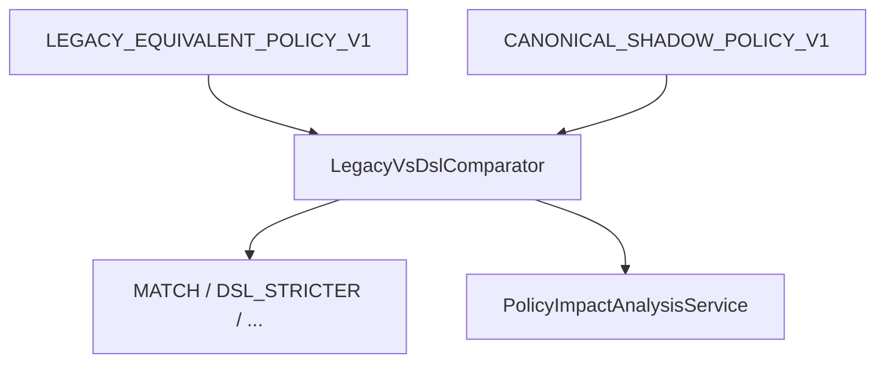

# 61 — Legacy vs DSL Shadow (P1)

## Packages

| Package | Purpose |
|---------|---------|
| LEGACY_EQUIVALENT_POLICY_V1 | Models documented legacy defaults; `NOT_ELIGIBLE_FOR_NEW_LENDER_USE` |
| CANONICAL_SHADOW_POLICY_V1 | Canonical facts/metrics; no silent defaults |

## Comparison classes

MATCH · DSL_STRICTER · DSL_MORE_PERMISSIVE · LEGACY_DEFAULT_DEPENDENT · CANONICAL_DATA_INSUFFICIENT · LEGACY_SEMANTIC_DIFFERENCE · POLICY_MAPPING_DIFFERENCE

Impact aggregates (approve→refer/fail, fail→pass, etc.) are diagnostic only — never auto-threshold selection.
