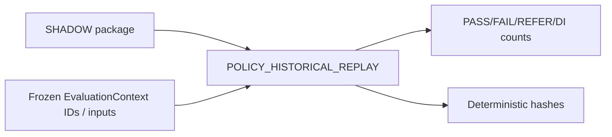

# 62 — Policy Historical Replay (P1)

## APIs

- `POST /policy-engine/simulate`
- `POST /policy-engine/replay/{evaluationContextId}`
- `POST /policy-engine/historical-replay`

Replay uses original package + frozen input maps + clock semantics. Same inputs → identical deterministic hash.

Named **POLICY_HISTORICAL_REPLAY** — not model validation / credit performance (repayment outcomes not linked).
