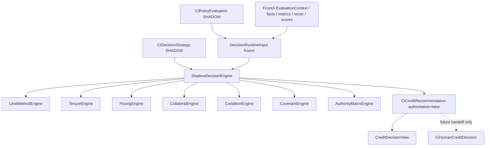

# 64 — Decision Engine Architecture (P2)

Shadow-only credit recommendation and facility structuring. Production underwriting authority is unchanged.

## Bounded context

`com.los.core.creditintelligence.decision`

| Concern | Owner |
|---------|-------|
| Policy outcome | P1 Shadow Policy Engine |
| Structuring / recommendation | ShadowDecisionEngine |
| Human final decision | CiHumanCreditDecision (P2 never writes) |
| AI | AI_SUGGESTION only — no authority |

## Constraints

- `authoritative=false` always
- Feature flags `credit-intelligence.decision-engine.*` default **false**
- Consume frozen inputs + `CiPolicyEvaluation` only
- Do not modify LoanApplicationFlowService, CAM, sanction, CreditControl gap defaults
- Strategy status used in P2: **SHADOW**
