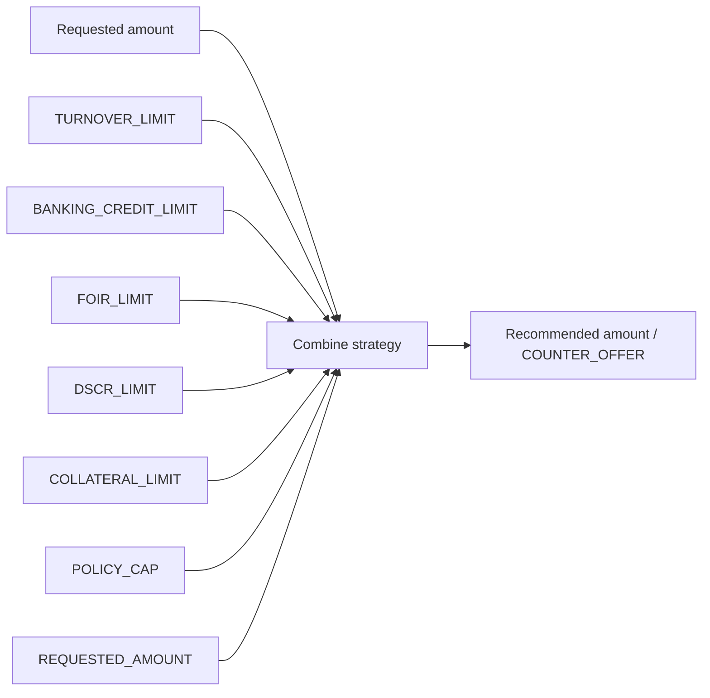

# 65 — Limit and Repayment Capacity (P2)

Multi-method limit sizing with strategy-driven combine. Never silent max of turnover sources.

## Methods

| Method | Formula sketch |
|--------|----------------|
| TURNOVER_LIMIT | `turnoverSource × turnoverPct` (GST/ITR/BANK/TRIANGULATED/MIN_OF_SOURCES) |
| BANKING_CREDIT_LIMIT | `bankingMultiplier × bankingMetric` |
| FOIR_LIMIT | `(income×allowedFoir − obligations) → principal via EMI_FLAT_V1 / EMI_REDUCING_V1` |
| DSCR_LIMIT | `(cashFlow / minDscr) → principal`; DI if missing |
| COLLATERAL_LIMIT | `collateral × (1−haircut) × maxLtv` |
| POLICY_CAP / REQUESTED_AMOUNT | Cap / request |

## Combine

`MIN` · `MAX` · `WEIGHTED` · `SELECT_PRIMARY` · `CONDITIONAL`

P2 validation fixture uses **MIN** of eligible methods.
