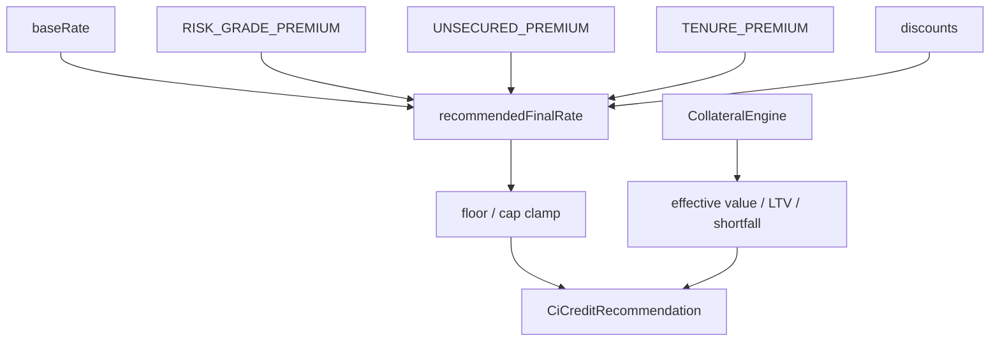

# 66 — Pricing and Collateral (P2)

Explicit, versioned pricing components and collateral LTV structuring.



## Pricing

```text
baseRate + Σ(component bps/10000) → clamp(floor, cap)
```

Evidence weakness prefers **REFER / conditions** when `evidenceWeaknessCausesRefer=true`, not silent price-up unless strategy says so.

## Collateral

- `required`, `maxLtv`, `haircut`
- Outputs: required value, available, effective, recommended LTV, shortfall
- Shortfall → condition (when strategy auto-generates)
