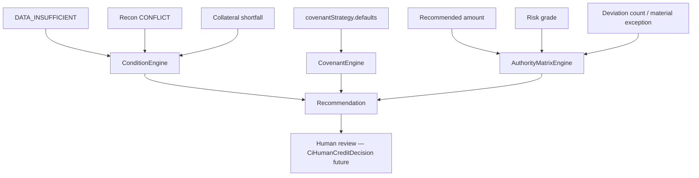

# 67 — Conditions, Covenants, Authority (P2)

Evidence-linked conditions/covenants and matrix-driven approval routing.

## Conditions

Types: `CONDITION_PRECEDENT`, `CONDITION_SUBSEQUENT`, `COVENANT`, `DOCUMENT_REQUIREMENT`, `MONITORING_REQUIREMENT`

Every condition carries reason, source, causing rule/recon, `mandatoryBefore`.

## Deviations

`CiPolicyDeviation` identified with status **REQUESTED**. P2 never auto-**APPROVED**.

## Authority bands (fixture example)

| Band | Level |
|------|-------|
| ≤ ₹5L, grade A/B, 0 deviations | CREDIT_MANAGER_L1 |
| ≤ ₹25L | CREDIT_MANAGER_L2 |
| else / material exception | CREDIT_COMMITTEE |
