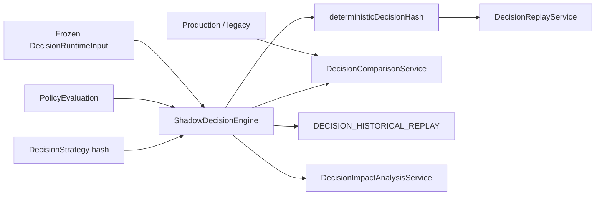

# 68 — Decision Replay and Comparison (P2)

Deterministic replay from frozen strategy + policy evaluation + context.

## Hash coverage

`outcome`, `amount`, `tenure`, `pricing`, `conditions`, `collateral`, `authority`, `reasonCodes`, `strategyHash` — excludes timestamps/ids.

## Comparison classes

`MATCH` · `CANONICAL_AMOUNT_LOWER/HIGHER` · `TENURE_DIFFERENT` · `PRICING_DIFFERENT` · `AUTHORITY_DIFFERENT` · `CONDITION_ADDED` · `DATA_INSUFFICIENT` · `LEGACY_DEFAULT_DEPENDENT`

## Historical replay

Labeled `DECISION_HISTORICAL_REPLAY` — not credit-performance validation.
