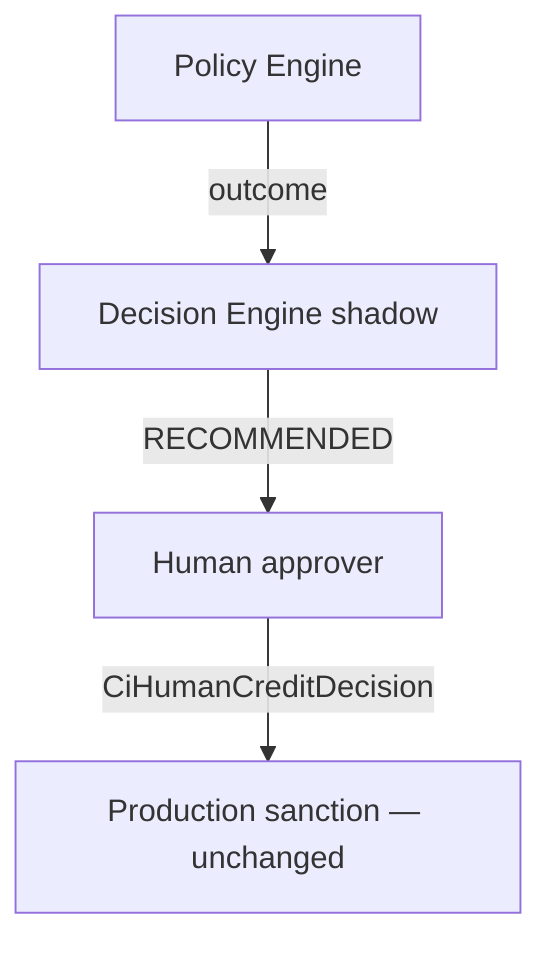

# 69 — P2 Validation Report

## Status

P2 Shadow Decision Engine implemented. Flags default **false**. Production underwriting unchanged. Recommendations are **non-authoritative** (`authoritative=false`). `CiHumanCreditDecision` table exists for future handoff; **P2 never writes** it automatically.

## Migrations

- **V104** — `ci_decision_strategy`, `ci_decision_input`, `ci_credit_recommendation`, limit/pricing/condition/covenant/deviation/authority/historical-replay/human-decision tables

## Completion checklist

| # | Criterion | Status |
|---|-----------|--------|
| 1 | Frozen canonical inputs only | Yes — DecisionRuntimeInput |
| 2 | Policy vs Decision separation | Yes |
| 3 | Multiple limit methods | Yes |
| 4 | Explainable amount | Yes — dimensions + explanation |
| 5 | Deterministic tenure | Yes |
| 6 | Explicit pricing components | Yes |
| 7 | Explicit collateral | Yes |
| 8 | Evidence-linked conditions/covenants | Yes |
| 9 | Matrix-driven authority | Yes |
| 10 | Deviations not auto-approved | Yes — REQUESTED only |
| 11 | Replayable hash | Yes |
| 12 | Credit Decision View | Yes — CreditDecisionView / withDecisionView |
| 13 | AI no authority | Yes |
| 14 | Human decision boundary explicit | Yes — table + p2Writes=false |
| 15 | Production unchanged | Yes — no flow/CAM/sanction/gap edits |
| 16 | Tests | ShadowDecisionEngineP2Test |

## Cutover

Authoritative decision cutover: **NOT READY**. Silent legacy gap defaults remain. Production Cutover Preparation must wait for validation gates + default removal.

## AI-LOS

Assistive integration may begin for summarize/explain only (`AI_SUGGESTION`). Must not mutate canonical recommendation fields.

## Next

Keep P2 shadow-only until C6/cutover gates clear; do not wire into LoanApplicationFlowService.
