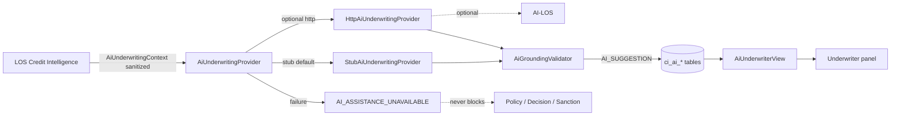

# 70 — AI Underwriter Architecture (A1)

Assistive AI-LOS integration for underwriting copilot features only. Production sanction, CAM authority, Policy Engine, and Decision Engine remain unchanged. AI never approves, rejects, sanctions, or disburses.

## Bounded context

`com.los.core.creditintelligence.aiunderwriter`

| Concern | Owner |
|---------|-------|
| Canonical facts / metrics / recon | Existing CI engines |
| Shadow recommendation | P2 ShadowDecisionEngine |
| Assistive narrative / explain / CAM draft | A1 AI underwriter |
| Human authority | Unchanged production flows |

## Constraints

- Every output: `authoritative=false`, `humanReviewRequired=true`, `outputMarker=AI_SUGGESTION`
- Feature flags `credit-intelligence.ai-underwriter.*` default **false**
- Provider default `stub` — LOS works without AI-LOS up
- New assistive flow **never** uses `DEMO_AI_LOS_URL` (legacy `AiLosIntegrationService` deep-link left intact)
- No mutation of facts, metrics, reconciliations, policy outcomes, recommendations, pricing, conditions, deviations

## Migration

- **V105** — `ci_ai_prompt_template`, `ci_ai_analysis_request`, `ci_ai_underwriting_suggestion`, `ci_ai_review`, `ci_ai_scenario`
