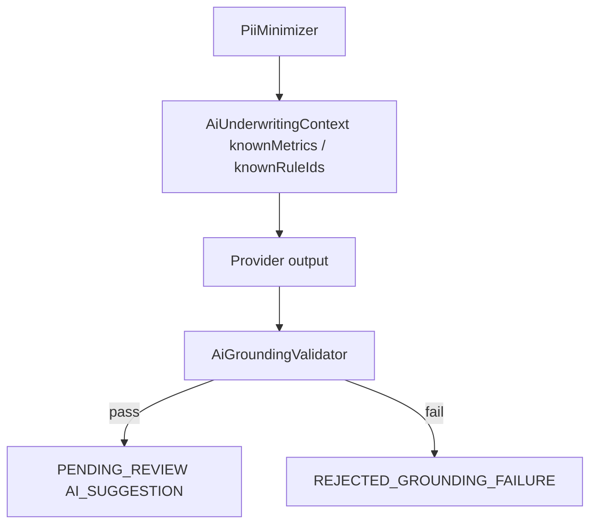

# 71 — AI Grounding and Safety (A1)

AI outputs must be grounded in canonical context. Invented metrics, numbers, rule IDs, or mismatched recommendation amounts are rejected.

## Validator checks

- Referenced metric paths exist in context / allowed canonical paths
- Large numeric literals appear in supplied evidence
- Rule IDs exist in known rule/recon set
- Claimed recommendation amount matches canonical
- Structured payload cannot smuggle invented metric/rule keys

## Confidence (separate, non-authoritative)

| Field | Meaning |
|-------|---------|
| `modelConfidence` | Provider self-score only |
| `groundingCoverage` | Fraction of claims matched to evidence |
| `evidenceCompleteness` | How complete the input evidence set is |

Never treat a single AI confidence as authority.

## Privacy

Before provider call: mask PAN / Aadhaar / account / phone / email / address; truncate narrations. No raw provider payloads in context.
