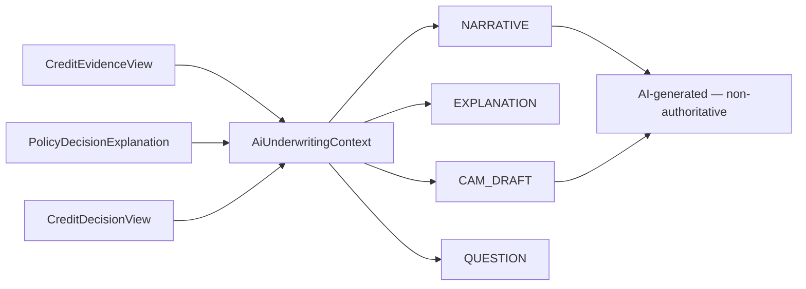

# 72 — AI CAM and Explanations (A1)

## Narrative sections

Borrower overview, data coverage, bureau, banking, GST, ITR/tax, turnover triangulation, obligations, policy outcome, recommended structure, conditions, key risks, key strengths, open questions.

## CAM draft

- Type `CAM_DRAFT` / `CREDIT_NOTE_DRAFT`
- Gated by `cam-draft-enabled` (default false)
- Does **not** mutate CAM sanction fields
- Underwriter must review/edit before use

## Policy explanation

Must cite deterministic rule/recon IDs present in context (e.g. `XSRC_GST_BANK_TURNOVER`). If evidence is missing, say so — do not invent.

## Investigation questions

Preserve original deterministic question + AI rewrite + evidence refs. AI must not suppress the discrepancy.
