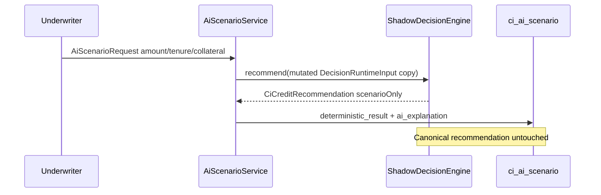

# 73 — AI Scenario Analysis (A1)

AI may describe what-if questions; **deterministic Decision Engine** computes amounts. AI only explains. Scenario rows are stored separately from canonical recommendations.

## Flags

- `ai-underwriter.scenario-enabled` default **false**

## Rules

- Mutate a **copy** of `DecisionRuntimeInput` only
- Persist `ci_ai_scenario` + `SCENARIO` suggestion
- `overwritesCanonical=false`
- AI outage / disabled → `AI_ASSISTANCE_UNAVAILABLE` (underwriting continues)
