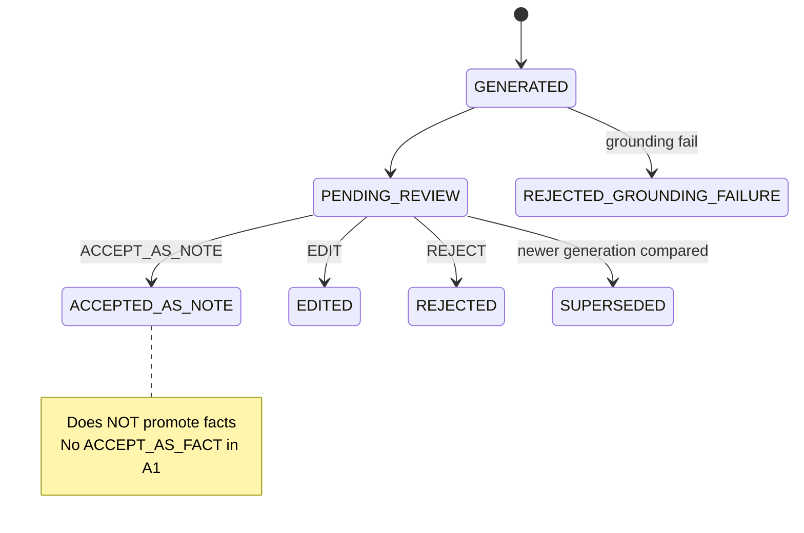
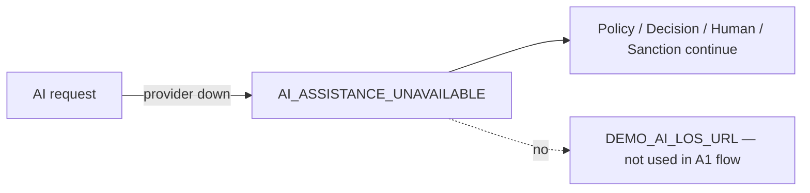

# 74 — AI Review and Feedback (A1)

## Actions

| Action | Effect |
|--------|--------|
| `ACCEPT_AS_NOTE` | Status note only — **not** fact promotion |
| `EDIT` | Persist edited content; still non-authoritative |
| `REJECT` | Reject suggestion |

`ACCEPT_AS_FACT` is rejected. `FACT_CANDIDATE` is design-only (`FactCandidateDesign.ACTIVATED_IN_A1=false`).

## Feedback codes

`USEFUL` | `NOT_USEFUL` | `INCORRECT` | `UNSUPPORTED` | `EDITED_HEAVILY`

Feedback never alters policy automatically.

## Failure fallback

