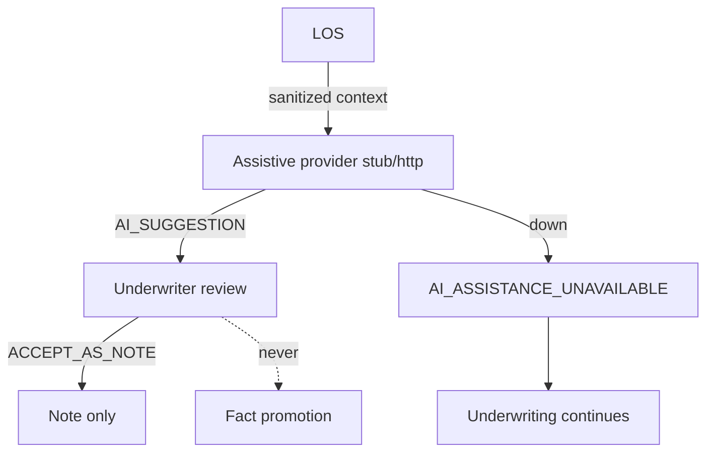

# 75 — A1 Validation Report

## Status

A1 Assistive AI Underwriter implemented. Flags default **false**. Provider default **stub**. Production underwriting unchanged. Legacy `AiLosIntegrationService` DEMO deep-link **not removed** in this phase; **new** assistive flow never uses it.

## Migrations

- **V105** — AI prompt templates, analysis requests, suggestions, reviews, scenarios + seed templates

## Completion checklist

| # | Criterion | Status |
|---|-----------|--------|
| 1 | Consumes canonical frozen views | Yes — AiUnderwritingContext |
| 2 | Outputs non-authoritative | Yes — AI_SUGGESTION |
| 3 | No fact/policy/recommendation/sanction mutation | Yes |
| 4 | Evidence refs on outputs | Yes |
| 5 | Grounding rejects invented facts/numbers/rules | Yes — AiGroundingValidator |
| 6 | CAM/narrative drafting | Yes |
| 7 | Investigation questions | Yes |
| 8 | Scenario → ShadowDecisionEngine | Yes |
| 9 | PII minimization | Yes |
| 10 | Prompt/model versions auditable | Yes |
| 11 | AI outage does not block underwriting | Yes — AI_ASSISTANCE_UNAVAILABLE |
| 12 | Underwriter review | Yes — ACCEPT_AS_NOTE/EDIT/REJECT |
| 13 | Production unchanged | Yes — no flow/CAM/sanction/gap edits |
| 14 | Tests | AiUnderwriterA1Test |

## Cutover

G0 Production Cutover Preparation: **NOT READY** (unchanged). A1 is assistive-only and does not authorize cutover.

## Remaining blockers (non-A1)

- Silent legacy gap defaults remain in production CreditControl
- Authoritative decision cutover still gated on C6/validation
- FACT_CANDIDATE promotion deferred
- Legacy DEMO deep-link retirement deferred (document only in A1)
