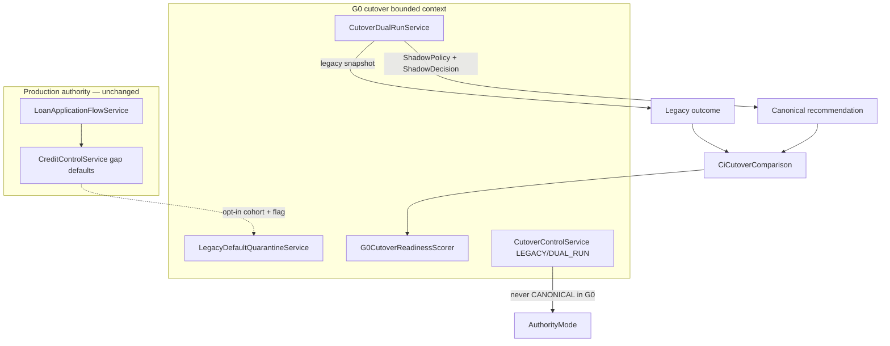

# 76 — Cutover Architecture (G0)

G0 prepares production authority cutover without switching underwriting authority. Canonical Policy/Decision remain shadow-only. Feature flags `credit-intelligence.cutover.*` default **false**. `allow-canonical-authority` must stay **false**.

## Package

`com.los.core.creditintelligence.cutover` — readiness, dual-run, quarantine, binding/policy/decision certification, cohorts, rollback audit.

## Migration

**V106** — `ci_legacy_default_definition`, `ci_cutover_cohort`, `ci_cutover_dimension`, `ci_cutover_comparison`, `ci_cutover_readiness_snapshot`, `ci_policy_certification`, `ci_decision_certification`, `ci_cutover_control`, `ci_cutover_review`, binding certification columns.

## Constraints

- No ACTIVE cohort seed; no CANONICAL control mode in G0 APIs
- No `LoanApplicationFlowService` authority path change
- Quarantine does not permanently mutate `CreditControlService`
