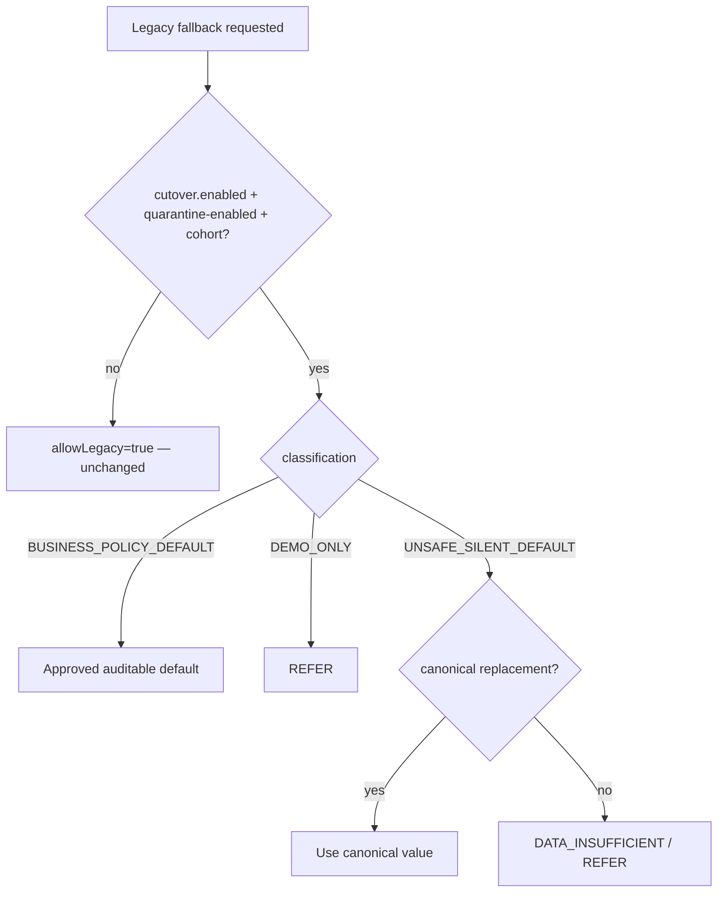

# 77 — Legacy Default Elimination (G0)

Defaults are inventoried, classified, and optionally quarantined for enabled cohorts. Production gap defaults are **not deleted** in G0.

## Classifications

| Class | Meaning |
|-------|---------|
| UNSAFE_SILENT_DEFAULT | Missing data filled with underwriting numbers (e.g. GST ₹5.2Cr) |
| BUSINESS_POLICY_DEFAULT | Explicit policy config (e.g. pricing floor) |
| DEMO_ONLY | Demo fallback path |
| DATA_GAP_FALLBACK / TECHNICAL / DEV_ONLY | Other inventory buckets |

## Catalog source

`LegacyDefaultInventory` + CreditControl known keys → `ci_legacy_default_definition` / `LegacyDefaultCatalogService`.
