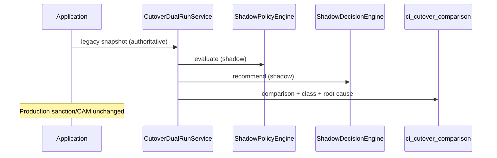

# 78 — Dual-Run Certification (G0)

For the same application, persist legacy authoritative outcome alongside canonical shadow Policy + Decision recommendation. Production action remains legacy.

## Comparison classes

`EXACT_MATCH`, `NON_MATERIAL_DIFFERENCE`, `MATERIAL_*`, `CANONICAL_REFER`, `CANONICAL_DATA_INSUFFICIENT`, `LEGACY_DEFAULT_DEPENDENT`, `CANONICAL_MORE_PERMISSIVE`, `CANONICAL_STRICTER`.

## Honesty

Dual-run statistics are computed **only** from persisted comparison rows (fixture/dev). Empty sample → null percentages, `insufficientSample=true`. Never fabricate match rates.
