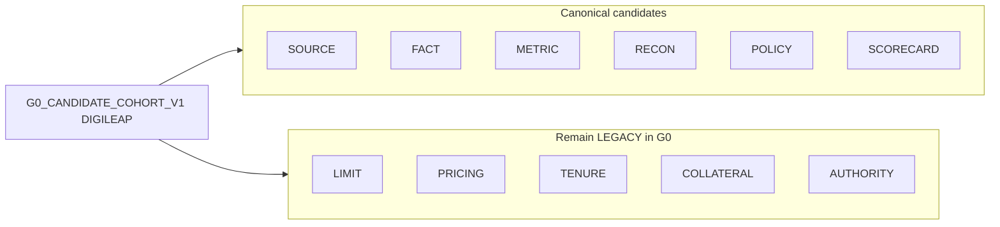

# 79 — Hybrid Cutover (G0)

Cutover is dimension-by-dimension, not big-bang.

## Candidate cohort

- Tenant `00000000-0000-0000-0000-000000000001`
- Product `DIGILEAP` (aliases include `SCF_STARTER`)
- Status `VALIDATION` (never `ACTIVE`)
- Metadata label `G0_CANDIDATE_COHORT_V1`
